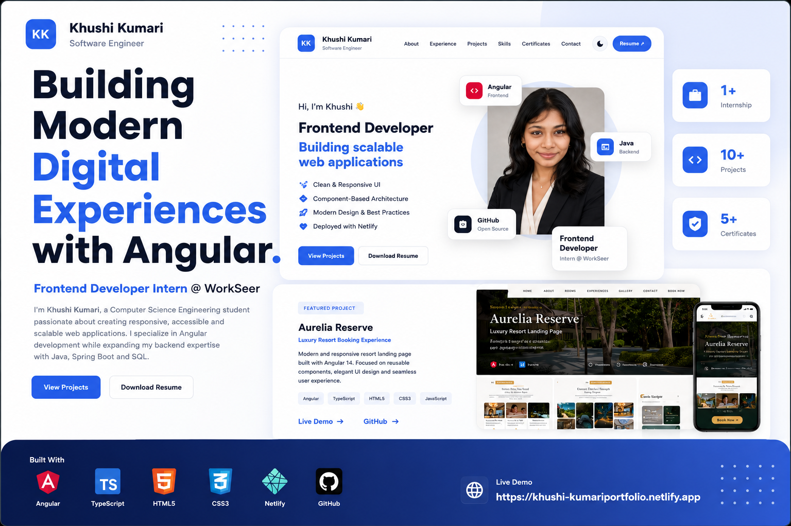

# Khushi Kumari — Software Engineering Portfolio

<p align="center">

Modern developer portfolio built with Angular, showcasing software engineering projects, internship experience, technical skills, certifications and professional achievements.

</p>

---

## Live Website

🔗 https://khushitheportfolio.netlify.app

---

## Preview

<p align="center">

<!-- Add portfolio-preview.png here -->



</p>

---

# About

This portfolio represents my software engineering journey as a Computer Science Engineering student and Frontend Developer Intern.

The website highlights:

- Professional introduction
- Internship experience
- Featured software projects
- Technical skills
- Certifications
- Resume
- Contact information

The project focuses on clean architecture, responsive design, reusable Angular components and modern UI practices.

---

# Features

- Responsive Design
- Modern UI/UX
- Dark Mode Toggle
- Smooth Scrolling
- Resume Download
- Project Showcase
- Professional Timeline
- Skills Dashboard
- Certifications Section
- Contact Section
- Mobile Friendly
- Optimized Deployment

---

# Built With

| Technology | Usage |
|------------|-------|
| Angular | Frontend Framework |
| TypeScript | Programming Language |
| HTML5 | Structure |
| CSS3 | Styling |
| Angular Material | UI Components |
| Git | Version Control |
| GitHub | Source Control |
| Netlify | Deployment |

---

# Project Structure

```
src
│
├── app
│   ├── components
│   ├── services
│   ├── models
│   └── shared
│
├── assets
│   ├── images
│   ├── logos
│   └── resume
│
└── environments
```

---

# Sections

✔ Hero

✔ About

✔ Experience

✔ Projects

✔ Skills

✔ Certifications

✔ Contact

---

# Featured Project

## Aurelia Reserve

Luxury Resort Landing Page built using Angular.

Highlights

- Responsive Layout
- Component-Based Architecture
- Modern UI
- Image Gallery
- Mobile Navigation

---

# Experience

**Frontend Developer Intern**

WorkSeer

Cloud-Based Global Trade Management Platform

Working on enterprise Angular applications while expanding backend knowledge in Java, Spring Boot and SQL.

---

# Certifications

- Tata GenAI Powered Data Analytics
- Deloitte Data Analytics
- Skyscanner Frontend Engineering
- DATACOM Software Development

---

# Installation

Clone the repository

```bash
git clone https://github.com/wh0-khushh/khushi-portfolio.git
```

Install dependencies

```bash
npm install
```

Run locally

```bash
ng serve
```

Build production

```bash
ng build
```

---

# Performance

- Responsive
- Optimized Assets
- Lazy Loading Ready
- SEO Friendly Structure
- Accessible Components

---

# Deployment

Hosted using **Netlify**

Automatic deployment from GitHub.

---

# Connect With Me

LinkedIn

www.linkedin.com/in/khushi-kumari-dev

GitHub

https://github.com/wh0-khushh

Email

khushhiii143offc@gmail.com

---

## License

MIT License

---

<p align="center">

Designed & Developed by **Khushi Kumari**

Built with ❤️ using Angular

</p>
